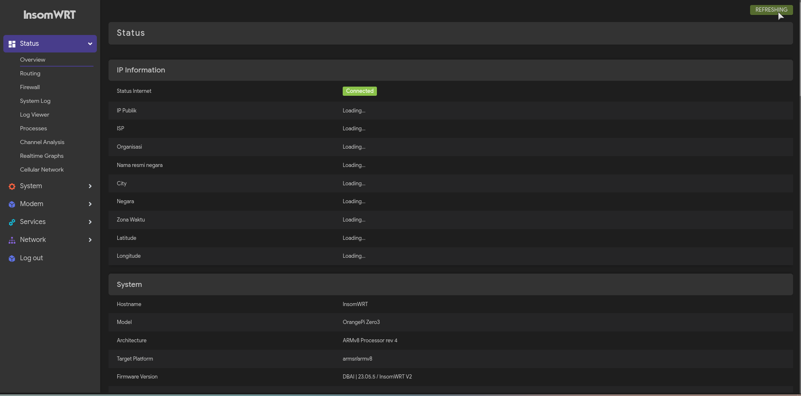
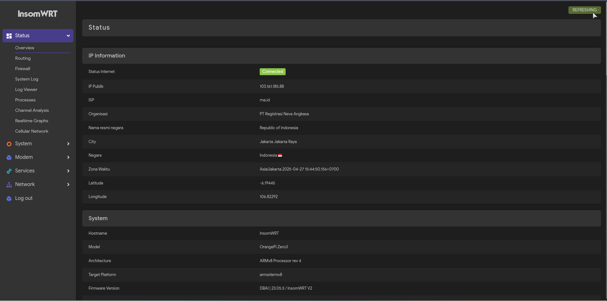
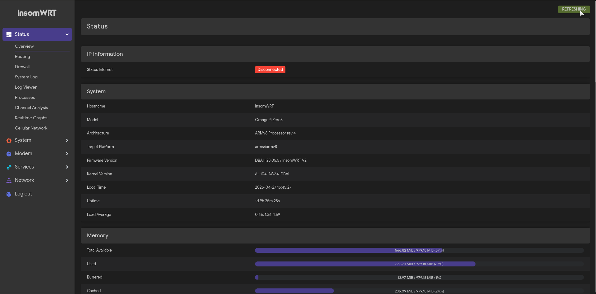

# luci-app-ipinfo for openwrt

[](https://github.com/bobbyunknown)
[](https://github.com/bobbyunknown/luci-app-ipinfo/releases)

### FITUR
* Internet connect or disconnect
* IP & ISP
* Organization & Country name
* Country & city
* Time zone
* Latitude & Longitude


## Install via Terminal
```
curl -s https://raw.githubusercontent.com/bobbyunknown/luci-app-ipinfo/master/install.sh | sh
```

# Preview



